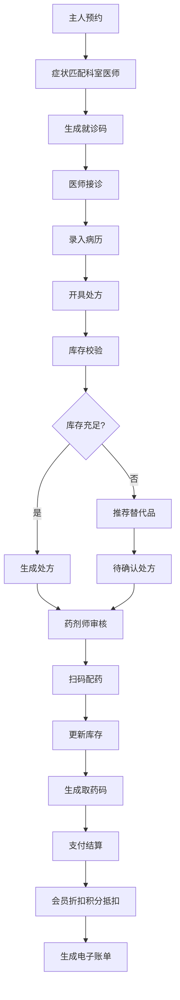

## 1. 产品概述

大型连锁宠物医院诊疗与会员管理平台，支持宠物主人、主治医师、药剂师和门店店长四种角色协同工作，实现从预约挂号、诊疗服务、药品配给到会员管理的全流程数字化管理。

- 解决宠物医院多角色协同效率低、库存管理混乱、会员服务不统一等问题
- 提升诊疗效率、优化客户体验、实现数据驱动的精细化运营

## 2. 核心功能

### 2.1 用户角色

| 角色 | 注册方式 | 核心权限 |
|------|----------|----------|
| 宠物主人 | 手机号注册 | 预约挂号、查看病历、支付费用、投诉建议、积分管理 |
| 主治医师 | 管理员创建 | 录入病历、开具处方、查看预约、管理诊断服务 |
| 药剂师 | 管理员创建 | 审核处方、扫码配药、库存管理、生成取药码 |
| 门店店长 | 管理员创建 | 数据统计、投诉处理、满意度管理、报表查看 |

### 2.2 功能模块

1. **登录与权限模块**：多角色登录、权限控制、个人中心
2. **预约管理模块**：在线预约、症状匹配、就诊码生成、预约提醒
3. **诊疗管理模块**：电子病历、处方开具、库存校验、替代品推荐
4. **药房管理模块**：处方审核、扫码配药、库存更新、取药码推送
5. **支付与会员模块**：会员等级、积分管理、折扣计算、电子账单
6. **投诉管理模块**：投诉提交、自动分派、处理跟进、确认关闭
7. **数据统计模块**：就诊量统计、满意度排行、营业收入、药品消耗
8. **消息推送模块**：实时消息、凭证下载、状态通知

### 2.3 页面详情

| 页面名称 | 模块名称 | 功能描述 |
|----------|----------|----------|
| 登录页 | 认证模块 | 多角色登录、密码找回、注册入口 |
| 主人首页 | 主人模块 | 宠物管理、快捷预约、我的预约、消息中心 |
| 预约页面 | 预约模块 | 选择门店、填写症状、智能匹配科室医师、确认预约 |
| 病历详情页 | 诊疗模块 | 查看病历记录、处方信息、诊疗费用 |
| 医师工作台 | 医师模块 | 今日预约、待诊列表、病历录入、处方开具 |
| 药剂师工作台 | 药房模块 | 待审核处方、待配药列表、扫码配药、库存查询 |
| 店长控制台 | 店长模块 | 数据概览、投诉处理、满意度排行、报表中心 |
| 支付页面 | 支付模块 | 费用明细、会员折扣、积分抵扣、支付确认 |
| 投诉页面 | 投诉模块 | 提交投诉、上传凭证、处理进度、确认关闭 |
| 消息中心 | 消息模块 | 系统通知、预约提醒、处方通知、投诉通知 |

## 3. 核心流程

### 3.1 预约就诊流程

主人填写预约信息和宠物症状 → 系统根据症状关键词匹配科室和医师 → 生成电子就诊码 → 推送预约成功消息 → 医师接诊 → 录入病历和处方 → 系统校验库存 → 缺货推荐替代品生成待确认处方 → 药剂师审核 → 扫码配药更新库存 → 生成取药码推送主人 → 支付时自动计算会员折扣和积分抵扣 → 生成电子账单 → 推送支付完成消息

### 3.2 投诉处理流程

主人发起投诉并上传凭证 → 系统按类型自动分派给对应店长 → 店长处理并回复 → 主人查看处理结果 → 确认关闭投诉 → 推送投诉处理完成消息

### 3.3 数据统计流程

系统每日凌晨自动统计营业收入和药品消耗 → 生成报表推送财务 → 店长可实时查看当日就诊量和满意度排行

## 4. 用户界面设计

### 4.1 设计风格

- **主色调**：专业医疗蓝 (#2563EB)，代表信任与专业
- **辅助色**：生命绿 (#10B981)，代表健康与活力；温馨橙 (#F59E0B)，代表关怀
- **中性色**：采用锌灰色系，确保内容清晰可读
- **按钮风格**：圆角 8px，微阴影，hover 时轻微上浮效果
- **字体**：使用 Noto Sans SC，标题字重 600，正文 400
- **布局风格**：卡片式布局，顶部导航 + 侧边栏 + 内容区
- **图标风格**：使用 lucide-react 线性图标，简洁现代

### 4.2 页面设计概述

| 页面名称 | 模块名称 | UI 元素 |
|----------|----------|----------|
| 登录页 | 认证模块 | 品牌 Logo、角色选择 Tab、登录表单、渐变背景 |
| 主人首页 | 主人模块 | 宠物卡片轮播、快捷功能入口、预约列表、消息提醒 |
| 预约页面 | 预约模块 | 门店选择、症状描述输入框、智能匹配结果、时间选择器 |
| 医师工作台 | 医师模块 | 数据看板、待诊列表、病历编辑器、处方表单 |
| 店长控制台 | 店长模块 | 数据图表、统计卡片、满意度排行、投诉列表 |
| 支付页面 | 支付模块 | 费用明细卡片、会员信息、支付方式选择、确认按钮 |

### 4.3 响应式设计

- 采用桌面优先设计，适配 1280px 及以上屏幕
- 平板端优化侧边栏收起功能
- 移动端简化布局，使用底部导航栏
- 所有表单元素支持触摸操作，最小点击区域 44px

### 4.4 交互动效

- 页面加载时的渐入动画和内容区的淡入效果
- 卡片 hover 时的轻微上浮和阴影加深
- 按钮点击时的缩放反馈
- 表单提交时的加载状态和成功提示
- 消息通知的滑入动画
- 数据图表的渐入动画效果
