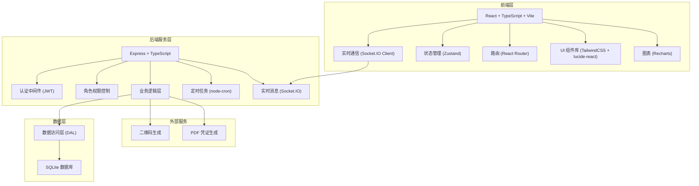
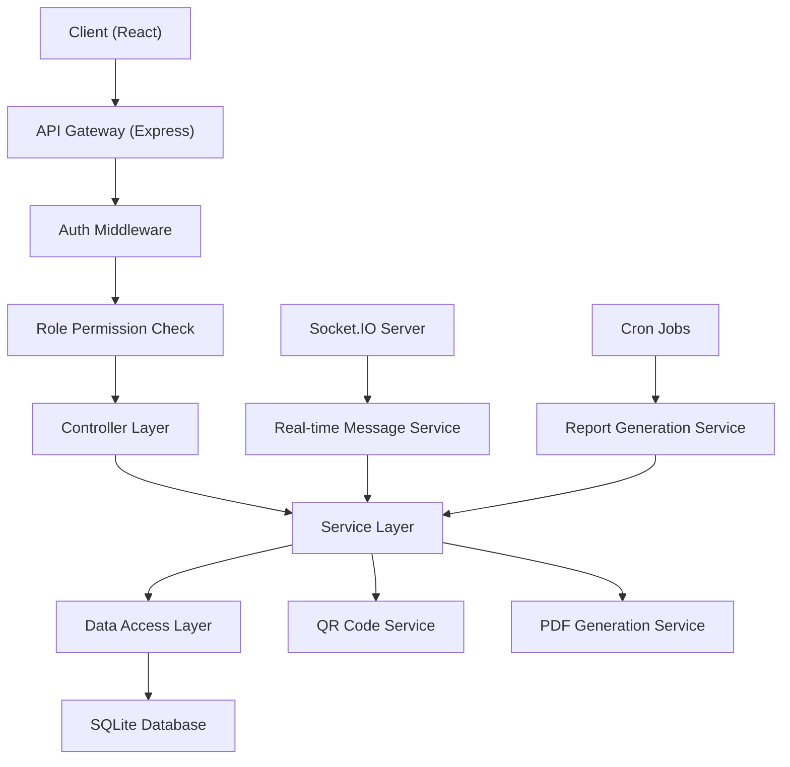
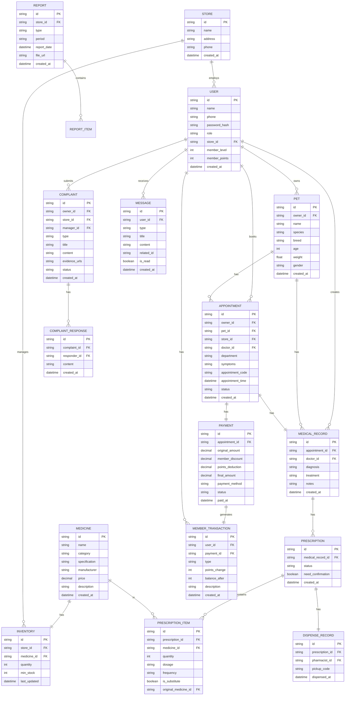

## 1. 架构设计



## 2. 技术描述

- **前端**：React@18 + TypeScript + TailwindCSS@3 + Vite
- **初始化工具**：vite-init，使用 react-express-ts 模板
- **后端**：Express@4 + TypeScript + ESM
- **数据库**：SQLite（使用 better-sqlite3），轻量级部署方便
- **实时通信**：Socket.IO
- **状态管理**：Zustand
- **路由**：React Router DOM
- **图表**：Recharts
- **二维码**：qrcode
- **定时任务**：node-cron
- **密码加密**：bcryptjs
- **Token**：jsonwebtoken

## 3. 路由定义

| 路由 | 用途 | 权限角色 |
|------|------|----------|
| /login | 登录页面 | 公开 |
| /owner/home | 主人首页 | 宠物主人 |
| /owner/appointment | 预约页面 | 宠物主人 |
| /owner/pets | 宠物管理 | 宠物主人 |
| /owner/medical-records | 病历记录 | 宠物主人 |
| /owner/payment | 支付页面 | 宠物主人 |
| /owner/complaints | 投诉管理 | 宠物主人 |
| /owner/messages | 消息中心 | 所有登录用户 |
| /doctor/workspace | 医师工作台 | 主治医师 |
| /doctor/appointments | 预约列表 | 主治医师 |
| /doctor/medical-record/:id | 病历录入 | 主治医师 |
| /doctor/prescription/:id | 处方开具 | 主治医师 |
| /pharmacist/workspace | 药剂师工作台 | 药剂师 |
| /pharmacist/review | 处方审核 | 药剂师 |
| /pharmacist/dispense | 扫码配药 | 药剂师 |
| /pharmacist/inventory | 库存管理 | 药剂师 |
| /manager/dashboard | 店长控制台 | 门店店长 |
| /manager/complaints | 投诉处理 | 门店店长 |
| /manager/reports | 报表中心 | 门店店长 |
| /manager/satisfaction | 满意度排行 | 门店店长 |

## 4. API 定义

### 4.1 认证接口

```typescript
// POST /api/auth/login
interface LoginRequest {
  phone: string;
  password: string;
  role: 'owner' | 'doctor' | 'pharmacist' | 'manager';
}

interface LoginResponse {
  token: string;
  user: {
    id: string;
    name: string;
    phone: string;
    role: string;
    storeId?: string;
  };
}

// POST /api/auth/register
interface RegisterRequest {
  name: string;
  phone: string;
  password: string;
}
```

### 4.2 预约接口

```typescript
// POST /api/appointments
interface CreateAppointmentRequest {
  petId: string;
  storeId: string;
  symptoms: string;
  appointmentTime: string;
}

interface AppointmentResponse {
  id: string;
  appointmentCode: string;
  department: string;
  doctorId: string;
  doctorName: string;
  status: 'pending' | 'confirmed' | 'completed' | 'cancelled';
  qrCodeUrl: string;
}

// GET /api/appointments/match?symptoms=xxx
interface MatchResult {
  department: string;
  departmentId: string;
  doctors: Array<{
    id: string;
    name: string;
    specialty: string;
    rating: number;
  }>;
}
```

### 4.3 病历与处方接口

```typescript
// POST /api/medical-records
interface CreateMedicalRecordRequest {
  appointmentId: string;
  diagnosis: string;
  treatment: string;
  notes: string;
  prescriptions: Array<{
    medicineId: string;
    quantity: number;
    dosage: string;
    frequency: string;
  }>;
}

// POST /api/prescriptions/:id/confirm
interface ConfirmPrescriptionRequest {
  substituteMedicines?: Array<{
    originalId: string;
    substituteId: string;
    reason: string;
  }>;
}
```

### 4.4 药房接口

```typescript
// GET /api/inventory/check?medicineId=xxx&quantity=xxx
interface InventoryCheckResponse {
  available: boolean;
  currentStock: number;
  substitutes?: Array<{
    id: string;
    name: string;
    stock: number;
    price: number;
  }>;
}

// POST /api/prescriptions/:id/dispense
interface DispenseRequest {
  prescriptionCode: string;
}

interface DispenseResponse {
  pickupCode: string;
  qrCodeUrl: string;
}
```

### 4.5 支付接口

```typescript
// POST /api/payments/calculate
interface CalculatePaymentRequest {
  appointmentId: string;
  usePoints: number;
}

interface CalculatePaymentResponse {
  originalAmount: number;
  memberDiscount: number;
  pointsDeduction: number;
  finalAmount: number;
  earnedPoints: number;
}

// POST /api/payments
interface PaymentRequest {
  appointmentId: string;
  amount: number;
  paymentMethod: string;
  usePoints: number;
}
```

### 4.6 投诉接口

```typescript
// POST /api/complaints
interface CreateComplaintRequest {
  type: 'service' | 'medical' | 'billing' | 'other';
  title: string;
  content: string;
  evidenceUrls?: string[];
}

// POST /api/complaints/:id/resolve
interface ResolveComplaintRequest {
  response: string;
}

// POST /api/complaints/:id/close
interface CloseComplaintRequest {
  satisfaction: number;
}
```

## 5. 服务器架构图



## 6. 数据模型

### 6.1 ER 图



### 6.2 DDL 语句

```sql
-- 用户表
CREATE TABLE users (
  id TEXT PRIMARY KEY,
  name TEXT NOT NULL,
  phone TEXT UNIQUE NOT NULL,
  password_hash TEXT NOT NULL,
  role TEXT NOT NULL CHECK (role IN ('owner', 'doctor', 'pharmacist', 'manager', 'admin')),
  store_id TEXT,
  member_level INTEGER DEFAULT 1,
  member_points INTEGER DEFAULT 0,
  created_at DATETIME DEFAULT CURRENT_TIMESTAMP,
  FOREIGN KEY (store_id) REFERENCES stores(id)
);

-- 门店表
CREATE TABLE stores (
  id TEXT PRIMARY KEY,
  name TEXT NOT NULL,
  address TEXT NOT NULL,
  phone TEXT NOT NULL,
  created_at DATETIME DEFAULT CURRENT_TIMESTAMP
);

-- 宠物表
CREATE TABLE pets (
  id TEXT PRIMARY KEY,
  owner_id TEXT NOT NULL,
  name TEXT NOT NULL,
  species TEXT NOT NULL,
  breed TEXT,
  age INTEGER,
  weight REAL,
  gender TEXT,
  created_at DATETIME DEFAULT CURRENT_TIMESTAMP,
  FOREIGN KEY (owner_id) REFERENCES users(id)
);

-- 预约表
CREATE TABLE appointments (
  id TEXT PRIMARY KEY,
  owner_id TEXT NOT NULL,
  pet_id TEXT NOT NULL,
  store_id TEXT NOT NULL,
  doctor_id TEXT,
  department TEXT NOT NULL,
  symptoms TEXT NOT NULL,
  appointment_code TEXT UNIQUE NOT NULL,
  appointment_time DATETIME NOT NULL,
  status TEXT NOT NULL DEFAULT 'pending' CHECK (status IN ('pending', 'confirmed', 'in_progress', 'completed', 'cancelled')),
  satisfaction INTEGER,
  created_at DATETIME DEFAULT CURRENT_TIMESTAMP,
  FOREIGN KEY (owner_id) REFERENCES users(id),
  FOREIGN KEY (pet_id) REFERENCES pets(id),
  FOREIGN KEY (store_id) REFERENCES stores(id),
  FOREIGN KEY (doctor_id) REFERENCES users(id)
);

-- 病历表
CREATE TABLE medical_records (
  id TEXT PRIMARY KEY,
  appointment_id TEXT NOT NULL,
  doctor_id TEXT NOT NULL,
  diagnosis TEXT NOT NULL,
  treatment TEXT,
  notes TEXT,
  created_at DATETIME DEFAULT CURRENT_TIMESTAMP,
  FOREIGN KEY (appointment_id) REFERENCES appointments(id),
  FOREIGN KEY (doctor_id) REFERENCES users(id)
);

-- 处方表
CREATE TABLE prescriptions (
  id TEXT PRIMARY KEY,
  medical_record_id TEXT NOT NULL,
  status TEXT NOT NULL DEFAULT 'pending' CHECK (status IN ('pending', 'confirmed', 'reviewed', 'dispensed', 'cancelled')),
  need_confirmation BOOLEAN DEFAULT 0,
  created_at DATETIME DEFAULT CURRENT_TIMESTAMP,
  FOREIGN KEY (medical_record_id) REFERENCES medical_records(id)
);

-- 药品表
CREATE TABLE medicines (
  id TEXT PRIMARY KEY,
  name TEXT NOT NULL,
  category TEXT NOT NULL,
  specification TEXT,
  manufacturer TEXT,
  price DECIMAL(10, 2) NOT NULL,
  description TEXT,
  created_at DATETIME DEFAULT CURRENT_TIMESTAMP
);

-- 处方明细表
CREATE TABLE prescription_items (
  id TEXT PRIMARY KEY,
  prescription_id TEXT NOT NULL,
  medicine_id TEXT NOT NULL,
  quantity INTEGER NOT NULL,
  dosage TEXT,
  frequency TEXT,
  is_substitute BOOLEAN DEFAULT 0,
  original_medicine_id TEXT,
  FOREIGN KEY (prescription_id) REFERENCES prescriptions(id),
  FOREIGN KEY (medicine_id) REFERENCES medicines(id),
  FOREIGN KEY (original_medicine_id) REFERENCES medicines(id)
);

-- 库存表
CREATE TABLE inventory (
  id TEXT PRIMARY KEY,
  store_id TEXT NOT NULL,
  medicine_id TEXT NOT NULL,
  quantity INTEGER NOT NULL DEFAULT 0,
  min_stock INTEGER NOT NULL DEFAULT 10,
  last_updated DATETIME DEFAULT CURRENT_TIMESTAMP,
  FOREIGN KEY (store_id) REFERENCES stores(id),
  FOREIGN KEY (medicine_id) REFERENCES medicines(id),
  UNIQUE(store_id, medicine_id)
);

-- 配药记录表
CREATE TABLE dispense_records (
  id TEXT PRIMARY KEY,
  prescription_id TEXT NOT NULL,
  pharmacist_id TEXT NOT NULL,
  pickup_code TEXT UNIQUE NOT NULL,
  dispensed_at DATETIME DEFAULT CURRENT_TIMESTAMP,
  FOREIGN KEY (prescription_id) REFERENCES prescriptions(id),
  FOREIGN KEY (pharmacist_id) REFERENCES users(id)
);

-- 支付表
CREATE TABLE payments (
  id TEXT PRIMARY KEY,
  appointment_id TEXT NOT NULL,
  original_amount DECIMAL(10, 2) NOT NULL,
  member_discount DECIMAL(10, 2) NOT NULL DEFAULT 0,
  points_deduction DECIMAL(10, 2) NOT NULL DEFAULT 0,
  final_amount DECIMAL(10, 2) NOT NULL,
  payment_method TEXT,
  status TEXT NOT NULL DEFAULT 'pending' CHECK (status IN ('pending', 'paid', 'refunded')),
  paid_at DATETIME,
  FOREIGN KEY (appointment_id) REFERENCES appointments(id)
);

-- 会员积分记录表
CREATE TABLE member_transactions (
  id TEXT PRIMARY KEY,
  user_id TEXT NOT NULL,
  payment_id TEXT,
  type TEXT NOT NULL CHECK (type IN ('earn', 'spend', 'adjust')),
  points_change INTEGER NOT NULL,
  balance_after INTEGER NOT NULL,
  description TEXT,
  created_at DATETIME DEFAULT CURRENT_TIMESTAMP,
  FOREIGN KEY (user_id) REFERENCES users(id),
  FOREIGN KEY (payment_id) REFERENCES payments(id)
);

-- 投诉表
CREATE TABLE complaints (
  id TEXT PRIMARY KEY,
  owner_id TEXT NOT NULL,
  store_id TEXT NOT NULL,
  manager_id TEXT,
  type TEXT NOT NULL CHECK (type IN ('service', 'medical', 'billing', 'other')),
  title TEXT NOT NULL,
  content TEXT NOT NULL,
  evidence_urls TEXT,
  status TEXT NOT NULL DEFAULT 'pending' CHECK (status IN ('pending', 'assigned', 'processing', 'resolved', 'closed')),
  satisfaction INTEGER,
  created_at DATETIME DEFAULT CURRENT_TIMESTAMP,
  FOREIGN KEY (owner_id) REFERENCES users(id),
  FOREIGN KEY (store_id) REFERENCES stores(id),
  FOREIGN KEY (manager_id) REFERENCES users(id)
);

-- 投诉回复表
CREATE TABLE complaint_responses (
  id TEXT PRIMARY KEY,
  complaint_id TEXT NOT NULL,
  responder_id TEXT NOT NULL,
  content TEXT NOT NULL,
  created_at DATETIME DEFAULT CURRENT_TIMESTAMP,
  FOREIGN KEY (complaint_id) REFERENCES complaints(id),
  FOREIGN KEY (responder_id) REFERENCES users(id)
);

-- 消息表
CREATE TABLE messages (
  id TEXT PRIMARY KEY,
  user_id TEXT NOT NULL,
  type TEXT NOT NULL,
  title TEXT NOT NULL,
  content TEXT NOT NULL,
  related_id TEXT,
  is_read BOOLEAN DEFAULT 0,
  created_at DATETIME DEFAULT CURRENT_TIMESTAMP,
  FOREIGN KEY (user_id) REFERENCES users(id)
);

-- 报表表
CREATE TABLE reports (
  id TEXT PRIMARY KEY,
  store_id TEXT,
  type TEXT NOT NULL,
  period TEXT NOT NULL,
  report_date DATE NOT NULL,
  file_url TEXT,
  data TEXT,
  created_at DATETIME DEFAULT CURRENT_TIMESTAMP,
  FOREIGN KEY (store_id) REFERENCES stores(id)
);

-- 科室表
CREATE TABLE departments (
  id TEXT PRIMARY KEY,
  name TEXT NOT NULL,
  keywords TEXT NOT NULL,
  description TEXT,
  created_at DATETIME DEFAULT CURRENT_TIMESTAMP
);

-- 医师专长表
CREATE TABLE doctor_specialties (
  id TEXT PRIMARY KEY,
  doctor_id TEXT NOT NULL,
  department_id TEXT NOT NULL,
  keywords TEXT,
  rating REAL DEFAULT 5,
  FOREIGN KEY (doctor_id) REFERENCES users(id),
  FOREIGN KEY (department_id) REFERENCES departments(id)
);

-- 索引
CREATE INDEX idx_appointments_owner ON appointments(owner_id);
CREATE INDEX idx_appointments_doctor ON appointments(doctor_id);
CREATE INDEX idx_appointments_store ON appointments(store_id);
CREATE INDEX idx_appointments_time ON appointments(appointment_time);
CREATE INDEX idx_prescriptions_status ON prescriptions(status);
CREATE INDEX idx_messages_user ON messages(user_id, is_read);
CREATE INDEX idx_complaints_store ON complaints(store_id);
CREATE INDEX idx_inventory_store_medicine ON inventory(store_id, medicine_id);
```
